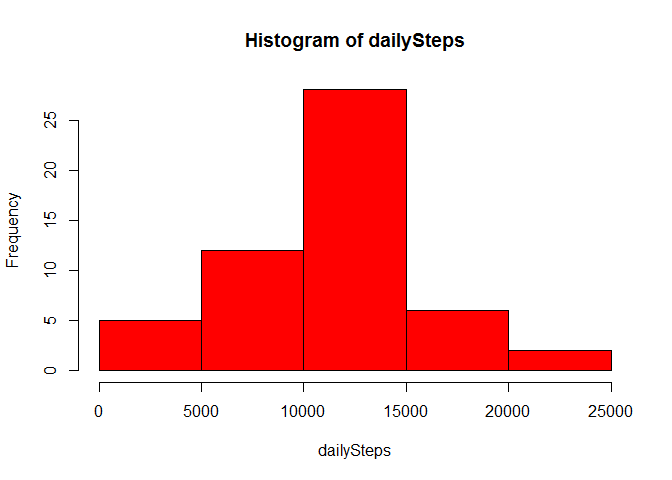
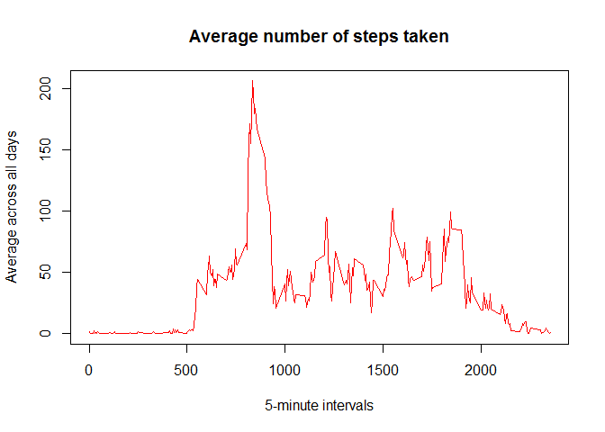
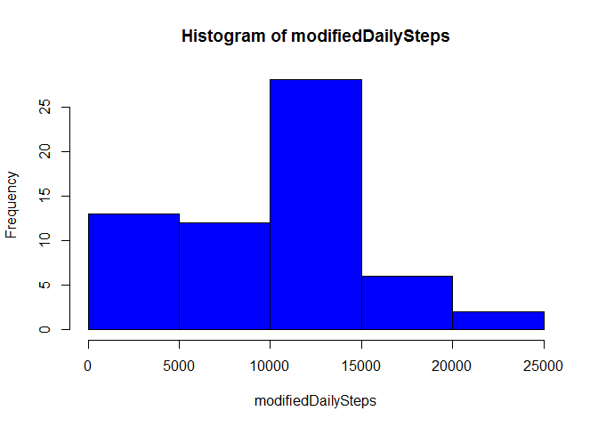

# Reproducible Research: Peer Assessment 1
Ramesh Balasubramanian  
February 14, 2015  


## Loading and preprocessing the data

1. Load the data (i.e. read.csv())


```r
require(plyr)
```

```
## Loading required package: plyr
```

```r
unzip("activity.zip", overwrite = T)
allActivityData <- read.csv("activity.csv")
```

2. Process/transform the data (if necessary) into a format suitable for your analysis (removing rows that contain NA)


```r
allActivityData$date <- as.Date(allActivityData$date, "%Y-%m-%d")
activityData <- allActivityData[complete.cases(allActivityData),]
```


## What is mean total number of steps taken per day?

1. Make a histogram of the total number of steps taken each day


```r
dailySteps <- ddply(activityData, .(date), summarize, total = sum(steps))$total
hist(dailySteps, col = "red")
```

 

2. Calculate and report the mean and median total number of steps taken per day


```r
mean(dailySteps)
```

```
## [1] 10766.19
```

```r
median(dailySteps)
```

```
## [1] 10765
```

## What is the average daily activity pattern?

1. Make a time series plot (i.e. type = "l") of the 5-minute interval (x-axis) and the average number of steps taken, averaged across all days (y-axis)


```r
averageStepsByInterval <- ddply(activityData, .(interval), summarize, 
                                averageSteps = mean(steps))
plot(averageStepsByInterval$interval, averageStepsByInterval$averageSteps, type = "l",
     xlab = "5-minute intervals", ylab = "Average across all days", 
     main = "Average number of steps taken", col = "red")
```

 

2. Which 5-minute interval, on average across all the days in the dataset, contains the maximum number of steps?


```r
averageStepsByInterval[which.max(averageStepsByInterval$averageSteps),]$interval
```

```
## [1] 835
```

## Imputing missing values

1. Calculate and report the total number of missing values in the dataset (i.e. the total number of rows with NAs)


```r
sum(is.na(allActivityData))
```

```
## [1] 2304
```

2. Devise a strategy for filling in all of the missing values in the dataset. The strategy does not need to be sophisticated. For example, you could use the mean/median for that day, or the mean for that 5-minute interval, etc.

Strategy is to replace each NA with the most recent non-NA prior to it or after it. There is a function na.locf in zoo package that provides this functionality

3. Create a new dataset that is equal to the original dataset but with the missing data filled in.


```r
require(zoo)
```

```
## Loading required package: zoo
## 
## Attaching package: 'zoo'
## 
## The following objects are masked from 'package:base':
## 
##     as.Date, as.Date.numeric
```

```r
modifiedActivityData <- na.locf(allActivityData, , fromLast = T)
modifiedActivityData <- na.locf(modifiedActivityData)
```

Verify that there are no NA values in this modifiedActivityData


```r
sum(!complete.cases(modifiedActivityData)) == 0
```

```
## [1] TRUE
```

4. Make a histogram of the total number of steps taken each day and Calculate and report the mean and median total number of steps taken per day. Do these values differ from the estimates from the first part of the assignment? What is the impact of imputing missing data on the estimates of the total daily number of steps?

Yes, the values differ from the estimates in the first part of the assignment because the NA values have been replaced by 0s and hence the change in first bin.


```r
modifiedDailySteps <- ddply(modifiedActivityData, .(date), summarize,
                            total = sum(as.numeric(steps)))$total
hist(modifiedDailySteps, col = "blue")
```

 

Both the median and mean values have reduced because of the introduction of 0s.


```r
mean(modifiedDailySteps)
```

```
## [1] 9354.23
```

```r
median(modifiedDailySteps)
```

```
## [1] 10395
```

## Are there differences in activity patterns between weekdays and weekends?

1. Create a new factor variable in the dataset with two levels - "weekday" and "weekend" indicating whether a given date is a weekday or weekend day.


```r
activityData$dayType <- ifelse(weekdays(activityData$date) %in% c("Sunday", "Saturday"), "Weekend", "Weekday")
activityData$dayType <- factor(activityData$dayType)
```

2. Make a panel plot containing a time series plot (i.e. type = "l") of the 5-minute interval (x-axis) and the average number of steps taken, averaged across all weekday days or weekend days (y-axis). See the README file in the GitHub repository to see an example of what this plot should look like using simulated data.


```r
stepsByDayType <- aggregate(steps ~ interval + dayType, data = activityData, mean)
library(lattice)
xyplot(steps ~ interval | dayType, stepsByDayType, type = "l", layout = c(1, 2), 
       xlab = "Interval", ylab = "Number of steps")
```

 
